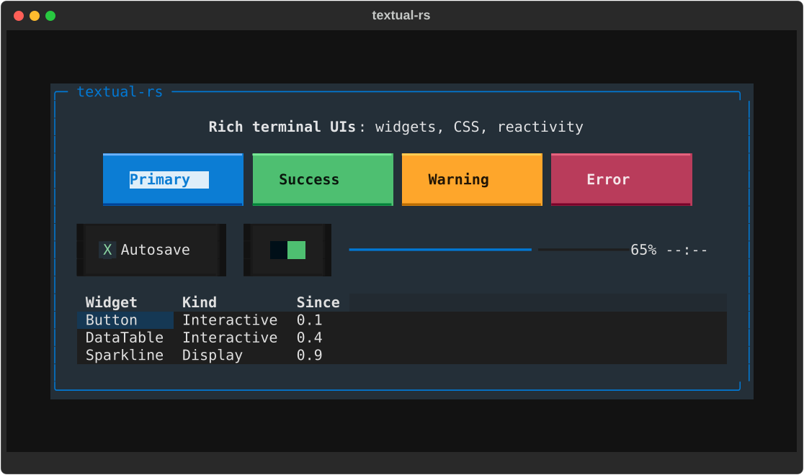
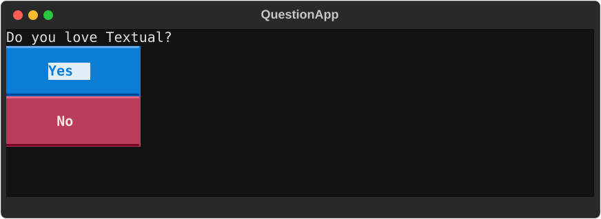
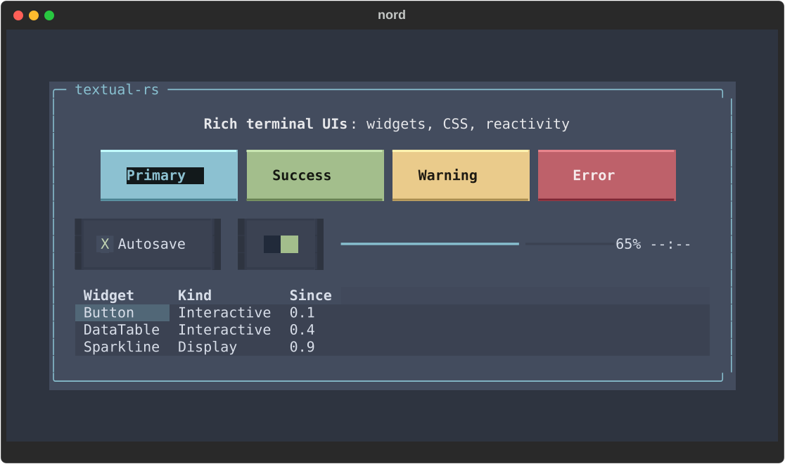
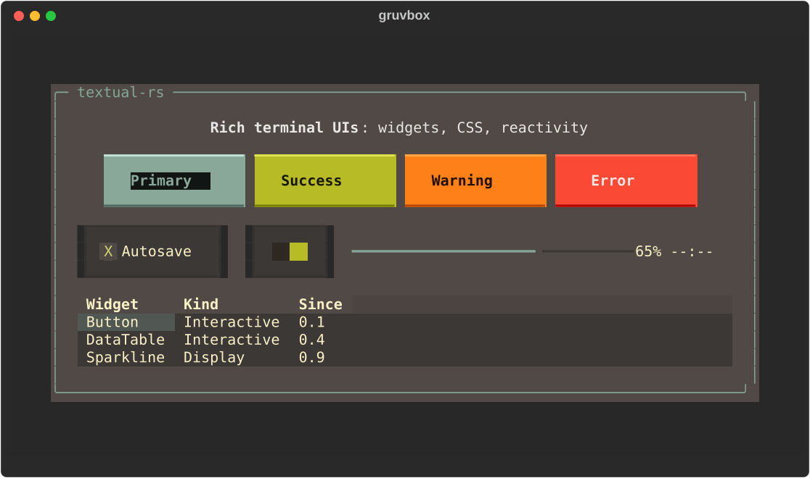
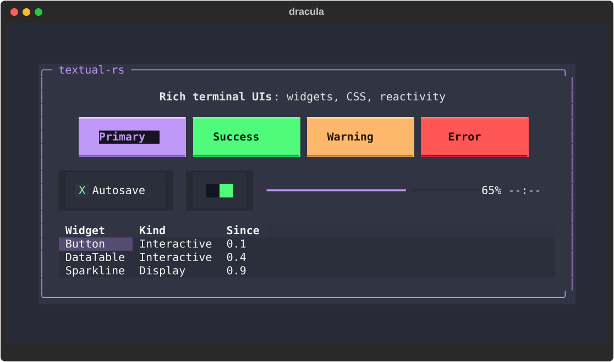
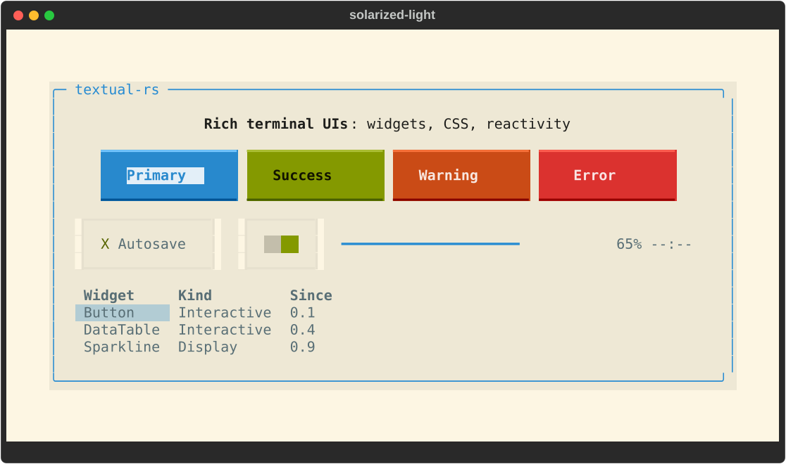
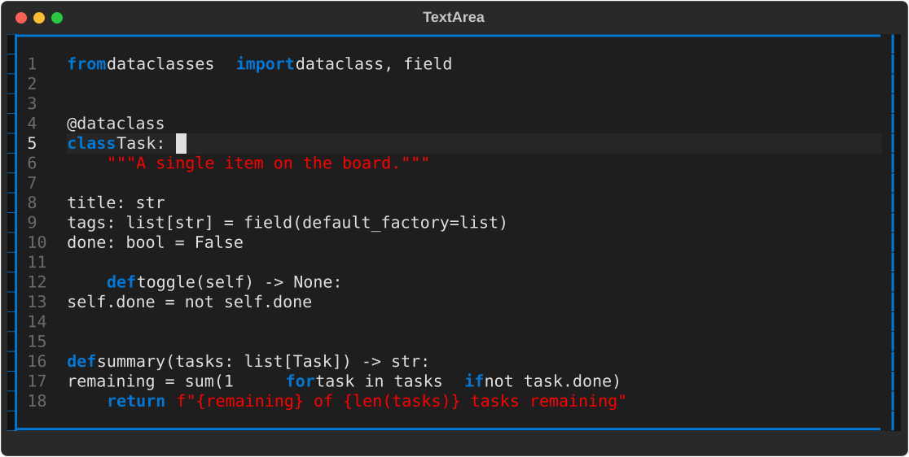
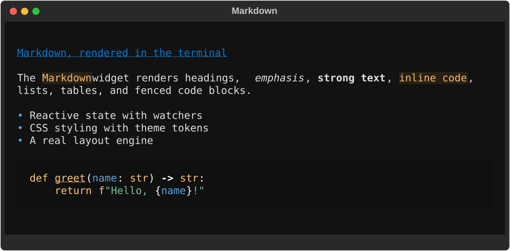
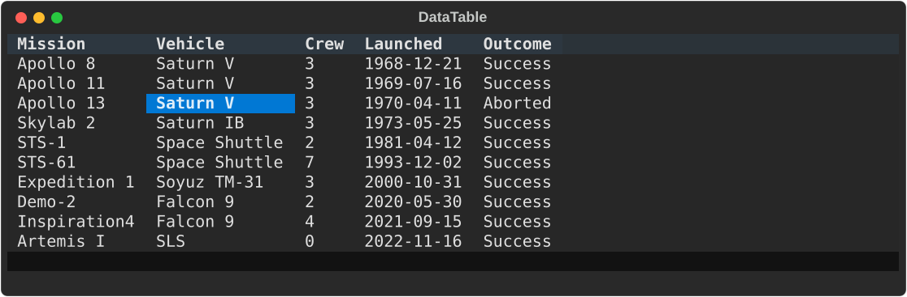
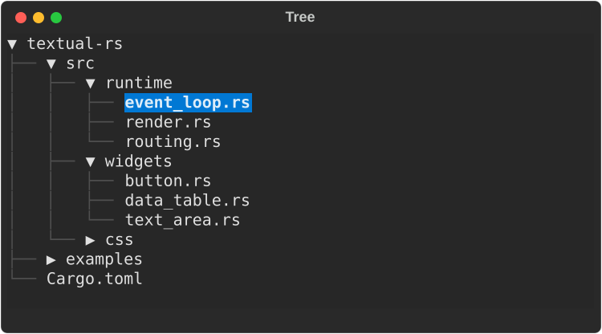

# rusty-textual

[](https://opensource.org/licenses/MIT)

**A reactive TUI framework for Rust.** Build rich terminal applications from composable
widgets, style them with CSS, lay them out with a real box model, and drive them with
reactive state and an event/message runtime. A faithful Rust port of Python's
[Textual](https://github.com/Textualize/textual), built on
[`rich-rs`](https://crates.io/crates/rich-rs) for rendering and
[`crossterm`](https://crates.io/crates/crossterm) for terminal I/O.



> **Attribution.** rusty-textual is a derivative work: a Rust port of
> [Textual](https://github.com/Textualize/textual), created by Will McGugan and the
> [Textualize](https://www.textualize.io/) team. All credit for the original framework
> design, API, and concepts goes to them. This project exists only because of their work.
> It was previously published on crates.io as the `textual` crate (1.1.0) and is not
> yet published under this name.

## Compatibility

Runs on Linux, macOS, and Windows. **Minimum Supported Rust Version: 1.85** (Rust 2024
edition). `unsafe` code is forbidden by lint configuration.

## Install

```toml
[dependencies]
rusty-textual = "1.1"
```

## A complete app

This is a whole application: a question with two buttons that prints your answer when
you pick one. Themed UI, mouse and keyboard handling, and focus management come for
free:

```rust
use rusty_textual::prelude::*;

struct QuestionApp {
    reply: Option<String>,
}

impl TextualApp for QuestionApp {
    fn compose(&mut self) -> AppRoot {
        AppRoot::new()
            .with_child(Label::new("Do you love Textual?"))
            .with_child(Button::primary("Yes").id("yes"))
            .with_child(Button::error("No").id("no"))
    }

    fn on_message(&mut self, message: &MessageEvent, ctx: &mut rusty_textual::event::WidgetCtx) {
        if let Some(m) = message.downcast_ref::<ButtonPressed>() {
            if let Some(id) = &m.button_id {
                self.reply = Some(id.clone());
            }
            ctx.request_stop();
            ctx.set_handled();
        }
    }

    fn take_exit_output(&mut self) -> Option<String> {
        self.reply.take()
    }
}

fn main() -> Result<()> {
    if let Some(reply) = run_sync_with_output(QuestionApp { reply: None })? {
        println!("You chose: {reply}");
    }
    Ok(())
}
```



To see the framework in action, ported Python documentation examples are runnable:

```bash
tools/run-doc-example.sh widgets buttons       # button states, variants, focus
tools/run-doc-example.sh widgets data_table    # sortable, keyboard-driven table
```

## Reactive state

Declare state as reactive fields and watchers run automatically whenever a value
changes, with no manual UI plumbing:

```rust
use rusty_textual::prelude::*;

#[derive(Reactive)]
struct ColorApp {
    #[reactive(watch_with_app)]
    color: Color,
}
```

`#[reactive]` and `#[var]` fields support watchers, `validate_<field>` hooks, layout
invalidation flags, and recompose triggers, mirroring Python Textual's reactivity model.

## Style with CSS

Stylesheets use Textual's TCSS syntax. Widgets ship per-widget default styles
(`src/css/defaults/`) aligned with Python Textual's widget CSS:

```css
Button {
    width: auto;
    min-width: 16;
    content-align: center middle;

    &.-style-flat {
        text-style: bold;
        background: $surface;

        &:hover {
            background: $primary;
        }
    }
}
```

Supported selectors: type, `#id`, `.class`, pseudo-classes (`:hover`, `:focus`,
`:active`, `:disabled`, `:can-focus`, `:dark`, `:light`, `:even`, `:odd`,
`:first-child`, `:last-child`, among others), descendant (` `), child (`>`), grouping
(`,`), and universal (`*`). Theme tokens (`$primary`, `$surface`, …) resolve against
the active theme with lighten and darken derivations. Load stylesheets from strings
with `App::load_stylesheet`, from files with `App::load_stylesheet_file`, and
hot-reload them with `App::watch_stylesheet`.

Widgets expose their internal parts as component classes, so app CSS can restyle a
widget's internals without subclassing.

### Themes

Every color token resolves against the active theme, so one call re-skins the whole
app (`app.set_theme_by_name("nord")`), and `App::register_theme` adds your own.
Built-in themes include `textual-dark`, `textual-light`, `nord`, `gruvbox`,
`tokyo-night`, `solarized-light`, `dracula`, and `monokai`; call
`available_theme_names()` for the full registry. The same screen under four themes:

| | |
|:---:|:---:|
|  |  |
|  |  |

### Animation

Styles animate through CSS transitions with easing curves: declare which properties
interpolate and the runtime animator tweens them on state changes.

```css
Button {
    transition: background 200ms ease-in-out, opacity 300ms linear;
}
```

## Layout

Five layout modes (**vertical**, **horizontal**, **grid**, **dock**, and **absolute**)
over a Python-faithful border-box model, with cells, `auto`, percentage, fractions
(`1fr`), and viewport units, min/max constraints, and `overflow` scrolling with real
scrollbars.

## Widgets

First-class widgets with focus, keyboard and mouse behavior, component styles,
messages, and tests:

**Interactive:** Button, Input, MaskedInput, TextArea, Checkbox, RadioSet, Switch,
Select, OptionList, SelectionList, ListView, DataTable, Tree, DirectoryTree, Tabs,
TabbedContent, Collapsible, CommandPalette, Link

**Display:** Label, Static, Markdown, Pretty, Digits, ProgressBar, LoadingIndicator,
Sparkline, RichLog, Log, Toast, Rule, Spacer, Placeholder, HelpPanel, KeyPanel

**Containers:** Container, ScrollView, Frame, Panel, Overlay, Constrained, Styled,
Center, Middle, Grid, Horizontal, Vertical

`TextArea` is a code editor with tree-sitter syntax highlighting, line numbers,
selections, soft-wrapping, and batched delta undo/redo:



`Markdown` renders documents in the terminal, including headings, lists, tables, and
highlighted code blocks:



`DataTable` scales to large datasets with fixed rows and columns, sorting, and a
keyboard-driven cell cursor:



`Tree` (and `DirectoryTree`) present hierarchical data with expandable nodes:



## Test without a terminal

Every app and widget is testable without a real terminal through the in-process
`Pilot` harness. Press keys, click, pause, and assert on the live state:

```rust
run_test(QuestionApp { reply: None }, |pilot| {
    assert!(!pilot.app().headless_stop_requested());
    pilot.click("#yes")?;                        // fire the button
    assert!(pilot.app().headless_stop_requested()); // handler ran, app exiting
    Ok(())
})?;
```

The suite holds thousands of tests: unit, integration, snapshot (through `insta`), and
real-PTY parity harnesses that diff Rust against the actual Python Textual output.

## Architecture

- **Event routing:** capture phase (root to focused) then bubble phase (focused to
  root); messages carry per-payload bubble flags.
- **Style resolution:** CSS cascade with specificity, inheritance, and `!important`.
- **Rendering:** invalidation-driven; only changed regions repaint.

## Python parity

Python Textual is the source of truth for behavior and default styling. The port aligns
semantics first (event, focus, and message behavior; layout and box-model rules), then
widget defaults and render-time composition. Parity is a continuously measured
verification floor: the visual harness holds 87 cell-exact sizing cases against Python,
the PTY harness holds around 180 cases, and an interactive harness diffs live Python
cell by cell. Intentional divergences are documented where they occur; the dispatch
rulings live in `docs/plans/2026-09-23-dispatch-model-rfc.md`. Rust idioms (ownership,
type safety, modular boundaries) apply throughout while preserving behavioral parity.

## Build and test

```bash
cargo build      # build the library
cargo test       # run the test suite
cargo clippy     # lint
cargo fmt        # format
```

### Debug

Opt-in, filterable instrumentation through environment variables:

```bash
TEXTUAL_DEBUG_STYLE_FILE=/tmp/style.log    # CSS resolution
TEXTUAL_DEBUG_LAYOUT_FILE=/tmp/layout.log  # layout calculations
TEXTUAL_DEBUG_INPUT_FILE=/tmp/input.log    # input events
TEXTUAL_DEBUG_RENDER_FILE=/tmp/render.log  # rendering
```

Narrow the output with a filter: `TEXTUAL_DEBUG_STYLE_FILTER='type=Button,class=error'`.

## Examples

Runnable ports of Python Textual examples live in `examples/`:

```bash
cargo run --example code_browser [PATH]  # file browser with syntax highlighting
cargo run --example five_by_five         # 5x5 toggle puzzle
cargo run --example dictionary           # as-you-type dictionary lookup
cargo run --example json_tree            # JSON tree viewer
cargo run --example markdown             # Markdown renderer
cargo run --example readme_screens       # README screenshots
```

## Status

**1.1.0**, the current release: Python parity plus cross-screen widget access,
CSS-restylable widget internals, a slotmap-backed Tree and OptionList identity model, a
TextArea document subsystem, a keymap subsystem, typed action, validation, and reactive
foundations, and fine-grained widget messages. See [`CHANGELOG.md`](CHANGELOG.md) for
release notes.

## License

MIT. See [LICENSE](LICENSE).
